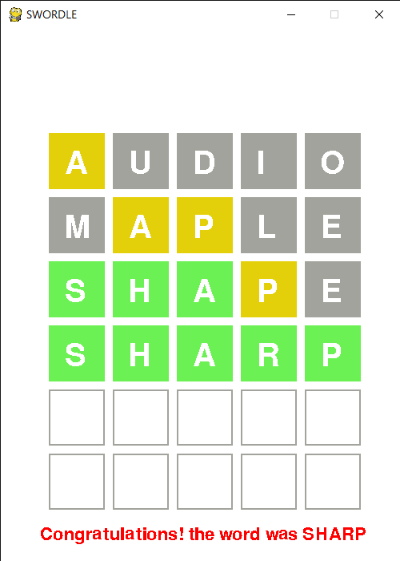

# Wordle-Python

A simple low-key clone of the popular game WORDLE made with python and a 2D Graphics module Pygame.

A simple low-key clone of the popular game WORDLE made with python and a 2D Graphics module Pygame.

## To run the game on your computer
1. To install python head over to their official website and go through the standard installation process https://www.python.org/
2. If you have any trouble with the installation you can watch a tutorial video: https://www.youtube.com/watch?v=Kn1HF3oD19c&ab_channel=AmitThinks
3. To install Pygame, open up your Command Prompt(for Windows) or Terminal(for Mac and Linux), type up the following command and hit enter.
```
    pip install pygame
```
4. To download the code, click on the green dropdown menu that says "Code" and select "Download zip".
5. Extract the ZIP file in your desired folder.
6. From now on you can run the code in two ways, first and the easiest thing to do is to open the folder in your favorite IDE and run the main.py file. If you don't have an IDE on your computer and don't wish to install one, you can still run the game. Just open the project folder, click on the location bar, type 'cmd', and hit enter. Your Windows command prompt should open up. Run the command
```
python main.py
```
and voila!
7. If you are on Mac, the process should be pretty much the same. Just use the terminal instead of Command prompt. If you are a Linux user, you should probably know your way around stuff. :p
8. I hope you like it!

## Screenshot


